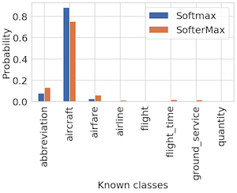
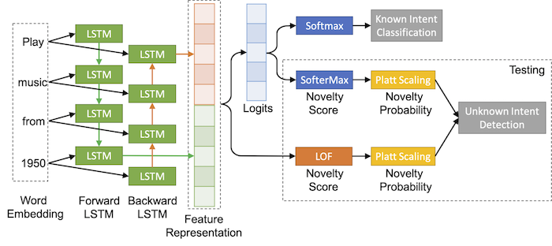
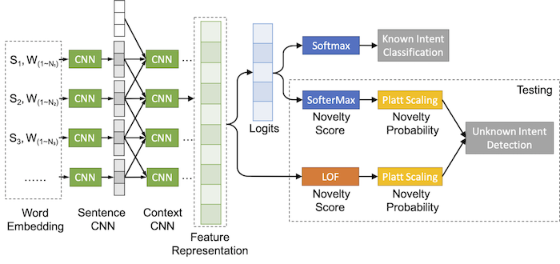
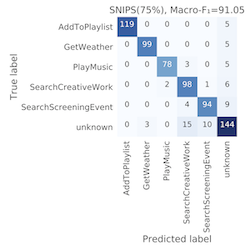
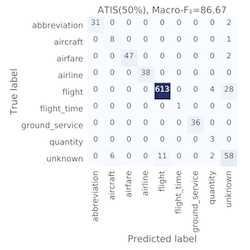
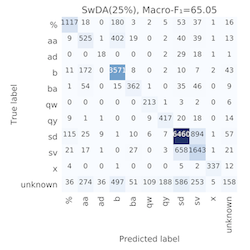

# SMDN: SofterMax and Deep Novelty detection
This repository contains the implementation of the research paper
`A post-processing framework for detecting unknown intent of dialogue system via pre-trained deep neural network classifier`, submitted to Knowledge-based Systems by `Tingen Lin, Hua Xu`

 In this paper, we propose SofterMax and deep novelty detection (SMDN), a simple yet effective post-processing method for detecting unknown intent in dialogue systems based on pre-trained deep neural network classifiers
. We calibrate the confidence  of DNN classifier via `temperature scaling` to make more reasonable/conservative prediction. Here is an example illustrating the difference between Softmax and SofterMax:



The architecture of the proposed SMDN method for the single-turn dialogue system.



The architecture of the proposed SMDN method for the multi-turn dialogue system.




## Usage
1. Install all required library
```
pip install -r requirements.txt
```

2. Unzip and preprocess SwDA dataset (and download your GloVe embedding & change the path in file)
```
unzip data/swda.zip
python preprocessing_swda.py
```
3. Get the pre-trained intent classifiers with different settings
```
python train.py
```

or you can get a single pre-trained classifier with
```
python train_BiLSTM.py <dataset> <proportion>
python train_BiLSTM-DOC.py <dataset> <proportion>
python train_HCNN.py <proportion>
python train_HCNN-DOC.py <proportion>
```

4. Evaluate the results with different detection method (DOC, SofterMax, LOF, SMDN, ...)
```
python eval.py
```
or you can get a single result with
```
python eval_BiLSTM.py <dataset> <proportion>
python eval_BiLSTM-DOC.py <dataset> <proportion>
python eval_HCNN.py <proportion>
python eval_HCNN-DOC.py <proportion>
```
### Result

|% of known intents|25%  |50% |75% |25% |50% |75% |25% |50% |75%  
:------------------|:---:|:--:|:--:|:--:|:--:|:--:|:--:|:--:|--:
|Datasets          |SNIPS|    |    |ATIS|    |    |SwDA|    |  
|Softmax (t=0.5)   |  -  |6.15|8.32|8.14|15.3|17.2|19.3|18.4|8.36
|DOC               |72.5|67.9|63.9|61.6|63.8|37.7|25.4|19.6|7.63
|DOC (Softmax)     |72.8|65.7|61.8|63.6|63.3|39.7|23.6|18.9|7.67
|SofterMax         |78.8|70.5|67.2|67.2|65.5|40.7|__28.0__|__20.7__|7.51
|LOF               |76.0|69.4|65.8|67.3|61.8|38.9|21.1|12.7|4.50
|SMDN              |__79.8__|__73.0__|__71.0__|__71.1__|__66.6__|__41.7__|20.8|18.4|__8.44__

Confusion matrix for SMDN experiment results on three different datasets

  
 
